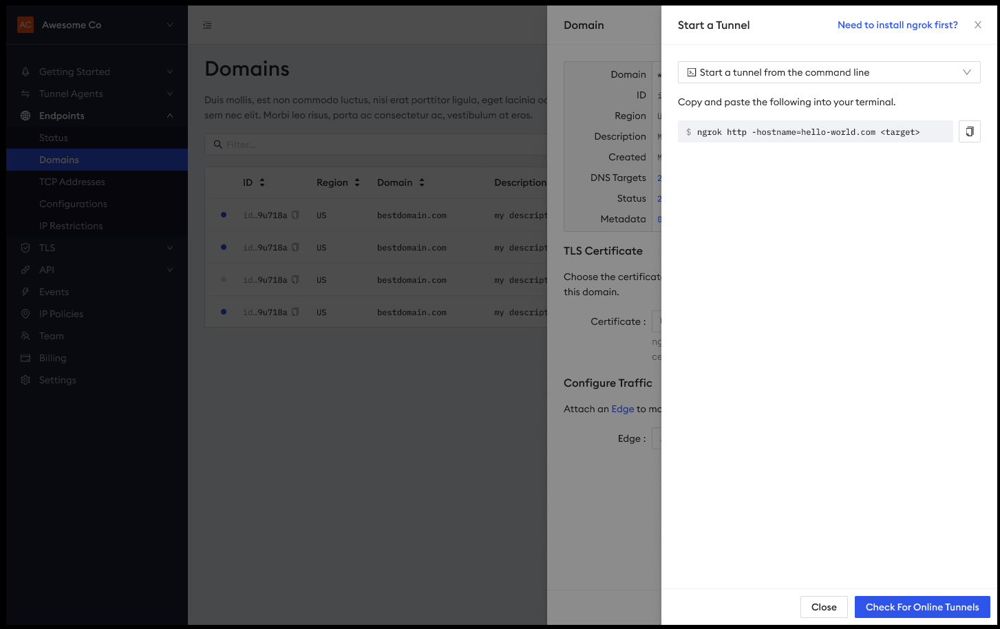

# Frontend Thinking

For this exercise, we're going to walk through some UI mockups for a new feature that our designer has provided us.
The feature is for creating a new domain with an associated automated wildcard TLS certificate.
They want to know if the design looks good and if there is any implementation feedback that you can give them.

Let's take a look at the screenshots of the mockups below. For each screenshot, let's have a conversation about:

- How would you implement the UI?
- What components/elements can you callout?
- Do you know of any edge cases that we should account for?
- What is the expected _shape_ of the backing data?
- Are there any external API calls?
- How do you keep track of _state_?

Extra questions may be sprinkled throughout the README.

## Step 1: New Domain Drawer

- For the _domain_ input, do you know how you would check for valid data?
- Can you tell me what the expected API looks like?
- What happens if/when you get any errors? How would you handle them?

## Step 2: DNS Targets Drawer

How would you expect to transition from the previous drawer to this drawer?

How would you implement the expanded alert?

## Step 3: Start a Tunnel Drawer

## Step 4: View Domain Drawer

